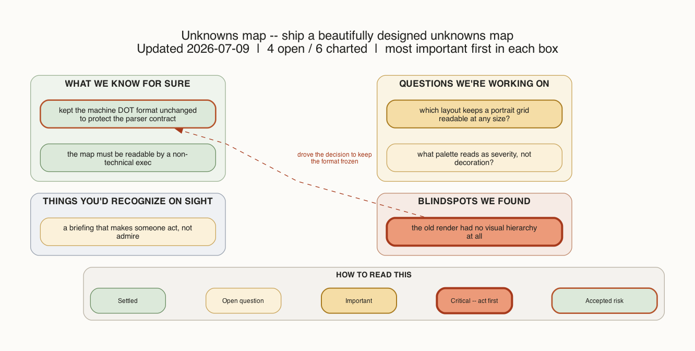

# amplifier-bundle-unknowns

Find and close the gap between what you asked for and what the work actually
requires -- before that gap gets expensive.

Think of your request as a map and the real codebase as the territory. They
never match perfectly. This bundle charts where they differ and drives each
difference to a decision, one cheap step at a time. Its real promise is
discovery: it helps you see things about your own project you couldn't see on
your own, even working with an AI. Avoiding costly rework is the floor;
seeing what you were blind to is the point.



*Every run produces a map like this -- four boxes an executive can walk in 60 seconds.*

## The four boxes

The map sorts every gap into one of four boxes. You only ever act on the
right-hand three; the first box is just what's already settled.

| Box | What lives here |
|---|---|
| **What we know for sure** | Facts you've stated and questions already resolved. Nothing to do. |
| **Questions we're working on** | Open questions you know you have (*known unknowns*) -- decide these next. |
| **Things you'd recognize on sight** | Preferences you never wrote down but would spot instantly (*unknown knowns*). |
| **Blindspots we found** | Things nobody thought to ask (*unknown unknowns*) -- the expensive surprises, caught early. |

## Quick start

Install the bundle:

```
amplifier bundle add https://github.com/michaeljabbour/amplifier-bundle-unknowns
```

Then pick either of the two easiest first runs.

**One-shot survey.** Point it at any goal and get the full map back with the
gaps prioritized and a suggested next move:

```
/unknownfinder Add a new OIDC auth provider to a codebase I don't know well
```

**Ask the cartographer.** In conversation, just ask the map-owner agent to
chart a task for you:

```
Chart the unknowns for: migrate the session store to Postgres
```

The living map is written to `.ai/unknowns-map.dot`, and `unknowns png`
renders the picture you saw above.

> **Note:** composing this into your own bundle instead of running it
> standalone? Include `behaviors/unknowns.yaml`, not the root bundle -- see
> [`behaviors/unknowns.yaml`](behaviors/unknowns.yaml) for why.

## What a session feels like

- You seed the map with a goal -- one sentence about what you're trying to do.
- The tool replies with a plain-language briefing: what's settled, what's
  open, what it suspects you'll recognize, and what it thinks nobody asked.
- It offers to go deeper -- an interview (one question at a time) or a
  blindspot pass (it teaches you the area first, then names the traps).
- As you answer, gaps move across the boxes and the map updates live. Nothing
  is deleted; a resolved gap stays on the map marked resolved, so you can see
  how you got there.
- It ends every turn with one concrete next step, not a dashboard.

A briefing reads like this:

```
Blindspots we found (1)
  * No agreed way to measure "did this help?" -- decide the success test
    before the pilot, or you'll only know in hindsight.

NEXT -> Answer the open questions, or say "interview me" to go one at a time.
```

## Going deeper

Five ways to run the same logic, from most guided to most raw:

- **Lifecycle pipeline** -- the full pre/during/post workflow with human gates: [`pipelines/unknowns-lifecycle.dot`](pipelines/unknowns-lifecycle.dot).
- **Amplifier Resolve** -- the pipeline registered in the dot-graph picker: [`pipelines/unknowns-lifecycle.resolver.yaml`](pipelines/unknowns-lifecycle.resolver.yaml).
- **Python library** -- deterministic map operations you can import: [`unknowns_map/`](unknowns_map/) (`import unknowns_map`).
- **Agent tool** -- the map operations exposed to agents: [`modules/tool-unknowns/`](modules/tool-unknowns/).
- **CLI** -- for humans and scripts: `unknowns seed`, `unknowns add`, `unknowns status`.

## File tour

| Path | What it is |
|---|---|
| [`agents/unknowns-cartographer.md`](agents/unknowns-cartographer.md) | The agent that owns the map -- seeds it, renders the briefing, updates it. |
| [`agents/unknownfinder.md`](agents/unknownfinder.md) | One-shot survey that fills all four boxes from a goal. |
| [`skills/blindspot-pass/SKILL.md`](skills/blindspot-pass/SKILL.md) | `/blindspot` -- teaches the area, then names the traps. |
| [`skills/unknownfinder/SKILL.md`](skills/unknownfinder/SKILL.md) | `/unknownfinder` -- slash entry point for the survey. |
| [`modes/interview.md`](modes/interview.md) | `/interview` -- one question at a time, hardest-first. |
| [`pipelines/unknowns-lifecycle.dot`](pipelines/unknowns-lifecycle.dot) | The full lifecycle as a runnable pipeline. |
| [`context/map-template.dot`](context/map-template.dot) | Seed template for a fresh map, with the node schema inline. |
| [`unknowns_map/`](unknowns_map/) | Python package: deterministic map ops + the `unknowns` CLI. |

## Composes with

- **[superpowers](https://github.com/microsoft/amplifier-bundle-superpowers)** -- an entry ramp before `/brainstorm` and an exit gate before `/finish`.
- **[stories](https://github.com/microsoft/amplifier-module-stories)** -- turns the post-work pitch and explainer into HTML stories.
- **[attractor](https://github.com/microsoft/amplifier-bundle-attractor)** -- hard dependency; provides the pipeline engine and the human-gate mechanism.

## Credit

Thariq ([@trq212](https://x.com/trq212)), Claude Code @ Anthropic --
["A Field Guide to Fable: Finding Your Unknowns"](https://x.com/trq212/status/2073100352921215386),
published July 3, 2026.

A reference copy of the article and its images is kept locally in `docs/`
(gitignored -- the original content is Thariq's and is not redistributed with
this repo; follow the link above for the published version).
