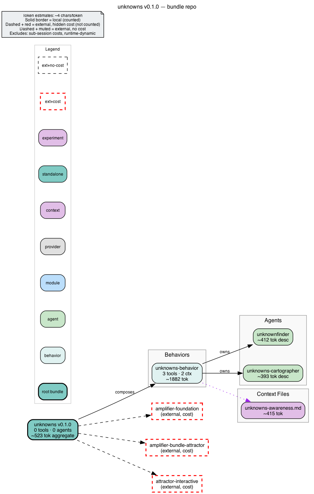

# amplifier-bundle-unknowns

Find and resolve unknowns -- the gap between your prompt (the map) and the
codebase/reality (the territory) -- before they get expensive to fix.

Implements the 4-quadrant unknowns matrix and lifecycle techniques from
Thariq's ([@trq212](https://x.com/trq212)) article
["A Field Guide to Fable: Finding Your Unknowns"](https://x.com/trq212/status/2073100352921215386)
as a living Amplifier bundle: a DOT artifact (`.ai/unknowns-map.dot`) that
every technique reads and writes, plus the techniques themselves wired as a
mode, an inline skill, a context-sink agent, and an
[attractor](https://github.com/microsoft/amplifier-bundle-attractor)
pipeline.

**Status:** experimental, v0.1.0.

## The map is the spine

Every stage -- blindspot pass, interview, prototype fan-out, plan, quiz --
is defined as a transformation of one artifact: `.ai/unknowns-map.dot`. It's
a DOT digraph with four quadrant clusters (known knowns, known unknowns,
unknown knowns, unknown unknowns); each unknown is a node tagged
`quadrant=`/`status=`/`severity=`, and dashed reclassification edges record
which technique moved it. The `unknowns:unknowns-cartographer` agent owns
this file: it seeds it from your prompt and a repo scan, renders it as an
plain-language briefing in every response (so you see the territory *before* any
technique runs), and updates it as unknowns get resolved. Nothing is ever
deleted -- `resolved` is a status, not a disappearance; the history of how
something moved through the quadrants is the point.

## Quick start

Compose the **behavior** into your own bundle. The behavior
(`behaviors/unknowns.yaml`) is the reusable capability -- the agents, the
`/interview` mode, the `/blindspot` and `/unknownfinder` skills, and the
always-on awareness context -- and nothing else. It is the right include for
almost every use:

```yaml
includes:
  # foundation + attractor provide run_pipeline; this bundle depends on them.
  - bundle: git+https://github.com/michaeljabbour/amplifier-bundle-unknowns@main#subdirectory=behaviors/unknowns.yaml
```

> **Include the behavior, not the root bundle.** `@main` (no fragment)
> resolves the *root* bundle (`bundle.md`), which additionally pulls in
> foundation and attractor's *interactive* entry point to stand up a
> ready-to-run session. That is what you want when you run this bundle
> **standalone** (below) -- but when you are **composing unknowns into an
> existing bundle**, the root include re-runs foundation's own includes a
> second time and drags in an interactive orchestrator you already have. The
> `#subdirectory=behaviors/unknowns.yaml` form gives you the capability
> without the entry-point baggage.

### Run it standalone

To use this bundle *as* your session (not composed into another), point
Amplifier at the root bundle -- there the entry-point wiring is exactly what
you want:

```yaml
includes:
  - bundle: git+https://github.com/michaeljabbour/amplifier-bundle-unknowns@main
```

Then, in conversation:

```
/unknownfinder I'm adding a new OIDC auth provider but know nothing about this codebase's auth module.
```

One-shot full-spectrum discovery: returns the complete 4-quadrant map with
prioritized unknowns and a recommended next technique. The same method is
delegable from any composing session as the **`unknowns:unknownfinder`**
agent:

```
delegate(agent="unknowns:unknownfinder",
         instruction="Find the unknowns for: <goal>")
```

Go deeper with the focused techniques:

```
/blindspot
"I'm adding a new OIDC auth provider but know nothing about this codebase's auth module."
```

```
/interview
```

Run the full lifecycle (pre -> during -> post) via the pipeline tool that
ships with attractor:

```
run_pipeline(dot_file="unknowns:pipelines/unknowns-lifecycle.dot", goal="Add a new OIDC auth provider")
```

Render the lifecycle diagram yourself at any time:

```bash
dot -Tpng pipelines/unknowns-lifecycle.dot -o pipelines/unknowns-lifecycle.png
```

## Leverage levels

The lifecycle logic has ONE home -- the DOT pipeline + agent prompts (LLM
logic) and the `unknowns_map` package (deterministic map operations). Every
consumption surface is a thin adapter over that home, following the
[wiki-weaver](https://github.com/microsoft/amplifier-app-wiki-weaver) pattern:

| Level | Surface | Consumer |
|---|---|---|
| L1 | `pipelines/unknowns-lifecycle.dot` (+ `.resolver.yaml` sidecar) | attractor `run_pipeline`, Amplifier Resolve |
| L2 | `unknowns_map` Python package (`pip install amplifier-unknowns`) | other codebases: `import unknowns_map` |
| L3 | `modules/tool-unknowns` (agent-callable `unknowns_map` tool) | agents (wired into the cartographer) |
| L4 | `unknowns` CLI (`pipx/uv tool install amplifier-unknowns`) | humans, scripts, and L1 guards |

```bash
uv tool install "git+https://github.com/michaeljabbour/amplifier-bundle-unknowns@main"
unknowns seed "migrate session store to Postgres"   # fresh .ai/unknowns-map.dot
unknowns add ku "which retention policy?" --severity high
unknowns status                                      # terminal briefing
unknowns triage                                      # uu | uk | ku | clear (guard contract)
```

The deterministic core is stdlib-only. `scripts/dominant_quadrant.sh` remains
the zero-dependency shell mirror of `unknowns triage` for bare environments --
`tests/test_triage_contract.py` asserts the two never drift. The engine seam
(`unknowns run <goal>`) needs the `[engine]` extra plus a configured Amplifier
install.

## File tour

| Path | What it is |
|---|---|
| `bundle.md` | Root bundle (standalone entry point): includes foundation + attractor's interactive entry point + this bundle's own behavior. **Composing into another bundle? Include `behaviors/unknowns.yaml` instead** -- see Quick start. |
| `behaviors/unknowns.yaml` | The reusable capability: agent, mode wiring, skill wiring, always-on awareness context (the single source of the awareness file -- it is deliberately NOT also `@mention`ed in `bundle.md`) |
| `context/unknowns-awareness.md` | Always-on, <500-token pointer: map-vs-territory framing + triggers table |
| `context/unknowns-matrix.md` | Heavy methodology reference -- loaded only by the cartographer agent |
| `context/map-template.dot` | Seed template for a fresh `.ai/unknowns-map.dot`, with the node-attr schema documented inline |
| `context/ascii-render-spec.md` | Terminal briefing render spec (plain language, wrap-never-truncate, NEXT step), with a worked example |
| `agents/unknowns-cartographer.md` | Context-sink agent that owns `.ai/unknowns-map.dot` |
| `agents/unknownfinder.md` | One-shot full-spectrum discovery method (`unknowns:unknownfinder`) -- populates all four quadrants from a goal + territory survey |
| `modes/interview.md` | `/interview` -- one-question-at-a-time, read-only tools, architecture-impact priority |
| `skills/blindspot-pass/SKILL.md` | `/blindspot` -- inline skill (must converse with the user; cannot be a fork skill) |
| `skills/unknownfinder/SKILL.md` | `/unknownfinder` -- thin slash alias for the `unknownfinder` agent (one method, two entry points -- the skill delegates, it does not re-implement) |
| `pipelines/unknowns-lifecycle.dot` | The full pre/during/post lifecycle as an attractor pipeline |
| `scripts/dominant_quadrant.sh` | Deterministic shell guard: counts open unknowns per quadrant, routes the pipeline's triage node (zero-dep mirror of `unknowns triage`, contract-tested) |
| `pipelines/unknowns-lifecycle.resolver.yaml` | Resolve sidecar manifest: registers the lifecycle in the dot-graph resolver picker (L1) |
| `unknowns_map/` | Python package: deterministic map ops + `engine_runner` seam + `unknowns` CLI (L2/L4) |
| `modules/tool-unknowns/` | Agent-callable `unknowns_map` tool module over the lib (L3) |
| `pyproject.toml` | Packaging for `amplifier-unknowns` (console script `unknowns`; wheel force-includes the pipeline + template assets) |
| `tests/` | Deterministic-core tests incl. the shell/Python triage drift guard |
| `AGENTS.md` | How to work in this repo: validation commands, diagram regeneration, known pitfalls |
| `bundle.dot` / `bundle.png` | Auto-generated structural diagram of the bundle (bundle-to-dot v3; regenerate after structural changes -- see `AGENTS.md`) |
| `docs/` | Local-only, **gitignored**: reference copy of the original article, its images, and the source DOT sketches (not redistributed) |

## Composes with

- **[superpowers](https://github.com/microsoft/amplifier-bundle-superpowers)** --
  this bundle is an entry ramp before `/brainstorm` and an exit gate before
  `/finish`, not a replacement for the TDD workflow.
- **[stories](https://github.com/microsoft/amplifier-module-stories)** --
  pitches and explainer artifacts (post-implementation technique) render
  well as HTML stories.
- **[design-intelligence](https://github.com/microsoft/amplifier-bundle-design-intelligence)** --
  the prototype fan-out technique (unknown-knowns quadrant) benefits from
  design-intelligence's HTML artifact conventions.
- **[attractor](https://github.com/microsoft/amplifier-bundle-attractor)** --
  hard dependency. Provides the `run_pipeline` tool, the human-gate
  (`hexagon`) mechanism used by every gate in the lifecycle, and the DOT
  execution engine itself.

## Bundle structure at a glance



Generated per the bundle-to-dot v3 convention (`bundle.dot` embeds a
`source_hash` for freshness). Regeneration instructions live in `AGENTS.md`.

## Credit

Thariq ([@trq212](https://x.com/trq212)), Claude Code @ Anthropic --
["A Field Guide to Fable: Finding Your Unknowns"](https://x.com/trq212/status/2073100352921215386),
published July 3, 2026.

A reference copy of the article and its images is kept locally in `docs/`
(gitignored -- the original content is Thariq's and is not redistributed
with this repo; follow the link above for the published version).
